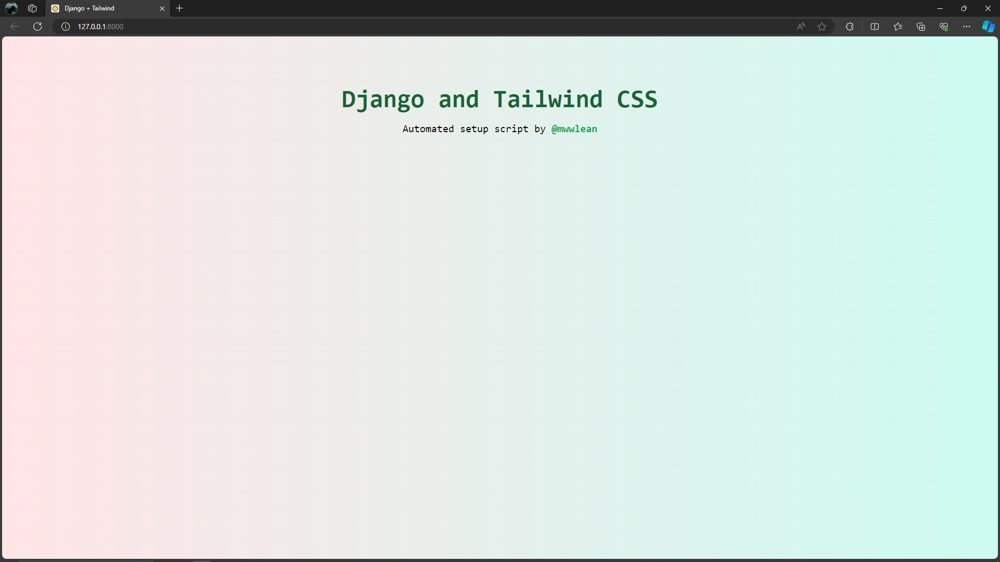

🐍💚💙 automate_setup.py for Django Project with Tailwind
---
Unleash the Power of Django with Automated Tailwind Setup Script for Rapidly Building Modern Websites!✨

<p align="left">
  <a href="https://skillicons.dev">
    
  </a>
</p>

## Clone or Fork this Repository💙
- 👀 Before you dive in, make sure that you have Node.js, Git, and Python installed on your computer.


## Installation

## Open your VSCode terminal.

Run the following script in your vscode terminal:
```bash
python automate_setup.py
```

## Open another VSCode terminal.

Navigate to the 'app' directory:
```bash
cd app
```

Start the development server:
```bash
python manage.py runserver
```


